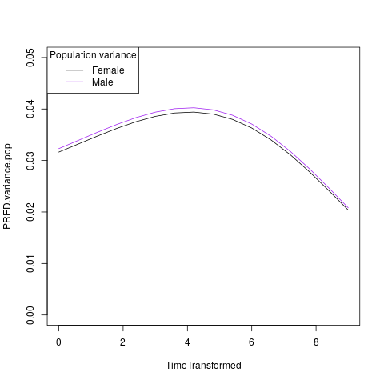
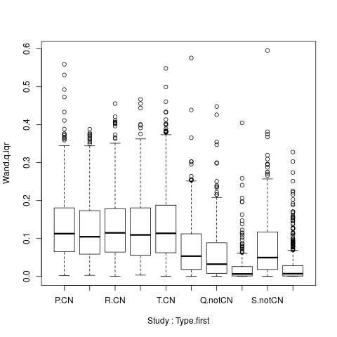

Tutorial
=====

This tutorial uses simulated data (as illustrated in the paper). This is generated using script ``220.simulation-omega.setup.r``. Either manually execute this script, or invoke R on the command line to execute the script. For example:

.. code-block:: console

  Rscript 220.simulation-omega-setup.r

For the following tutorial, the required functions and variables can be loaded by sourcing the following scripts:

.. code-block:: r

  source("100.common-variables.r")
  source("101.common-functions.r")

  source("300.variables.r")
  source("301.functions.r")

(Note: none of the above are specific to the simulated data)

.. _Model fitting (310-script) (SI 1.1, SI 1.3)

Model fitting (310-script) (SI 1.1, SI 1.3)
------------

First we load a dataset, in this tutorial we will use the Wand phenotype. Using a call to the ``Extract.Wrapper()`` function we can fit a model to the data. 

We will fit a single model, ``base200.GGalt.fp.rds``, using a Generalised Gamma outcome distribution (GG) including a second-order fractional polynomial of age in the mu-component, whereas the sigma-component and nu-components do not depend on age. This model specification uses the gamlss-pacakge in-built ``fp()`` function to determine the best-fitting fractional polynomial (of the specified order).

.. code-block:: r

  ## 310-script
  PATHS <- Create.Folders( "omega-Wand__.n0000" )
  HOLDER <- Load.Subset.Wrapper( Tag="omega-Wand__.n0000", LSubset=TRUE )
  HOLDER$MODEL <- readRDS( file.path( PATHS$MODEL, "base200.GGalt.fp.rds" ) )
  EXTRACT <- Extract.Wrapper( HOLDER, Store.Full=TRUE ) ## store full fitting object to use as initial point of bfpNA() re-fit [expect 12 iterations]
  summary(EXTRACT$FIT.FULL) ## standard summary of a GAMLSS fit
  getSmo(EXTRACT$FIT.FULL,what="mu")
  getSmo(EXTRACT$FIT.FULL,what="mu")$power

After the fitting in completed (in 12 iterations) we may inspect the fitted model using the usual ``summary()`` function. Further, since the fractional polynomial is included as a smoothing term, we may access the fitted smoother using ``getSmo()`` and find that the optimal second-order fractional polynomial has powers of 1 and 3 (i.e. a linear and cubic age-related term).

In order to properly compare models (since the ``fp()`` smoother term includes an intercept which complicates the interpretation of the main intercept, and to avoid any re-fitting of the fractional polynomial smoother, we translate the model from using the ``fp()`` smoother to a fixed transformation using ``bfp()``. This requires re-fitting the revised model as follows:

.. code-block:: r

  HOLDER$MODEL <- Make.bfpNA.model.from.extract( EXTRACT$param )
  saveRDS( HOLDER$MODEL, file.path( PATHS$MODEL, "base200.GGalt.bfpNA.rds" ) )
  EXTRACT.bfp <- Extract.Wrapper( HOLDER, Fit.Full=FALSE, start.from=EXTRACT$FIT ) ## helpful to start.from, improves convergence speed [expect 5 iterations]
  Save.Extracted( EXTRACT.bfp, PATHS, "base200.GGalt.bfpNA.rds", Save.Full=FALSE )

Note: we start the iterative model fitting at a better initial point, meaning the convergence occurs faster. We will do this for bootstrap replicates as well to reduce computation.

.. _Model selection (320-script) (SI 1.3)

Model selection (320-script) (SI 1.3)
------------

Using the fractional polynomial approach within with multiple components (mu, sigma, nu, tau) of the gamlss distribution families, leads to the question of the best model.

We can readily extract the BIC for a given model, then compare across models. In this tutorial we have only fitted one model, but there are many possible models within the ``RDS/omega-Wand__.n0000/MODEL/`` folder (different outcome distributions and component specifications).

.. code-block:: r

  ## 310-script
  EXTRACT.bfp$param$BIC ## compare BIC on all fitted models

  file.copy(from=file.path(PATHS$FIT.EXTRACT,"base200.GGalt.bfpNA.rds"),to=file.path(PATHS$PATH,"MODEL.rds"))
  file.copy(from=file.path(PATHS$FIT.EXTRACT,"base200.GGalt.bfpNA.rds"),to=file.path(PATHS$PATH,"FIT.EXTRACT.rds"))
  ## or
  file.symlink(from=file.path("MODEL","base200.GGalt.bfpNA.rds"),to=file.path(PATHS$PATH,"MODEL.rds"))
  file.symlink(from=file.path("FIT.EXTRACT","base200.GGalt.bfpNA.rds"),to=file.path(PATHS$PATH,"FIT.EXTRACT.rds"))

Our later scripts assume a single best model is selected, the last lines of code above copy (or create a link if on a system that allows such things).

.. _Model Uncertainty (330-script and 340-script) (SI 1.2)

Model Uncertainty (330-script and 340-script) (SI 1.2)
------------

We use the non-parametric bootstrap to determine uncertainty of our estimates. The ``Boot.Function()`` function takes a so-called Holder-object (data, model, fit), generates a stratified resample replicate, and refits the model.

The replicates are stratified by study and sex, to ensure balance across these two key factors. The existing fit is used to generate better initialisations (to reduce computing time/number of iterations).

Note: This step is "embarresingly parallel" and should be performed using more appropriate parallel computing on high performance computing (HPC) resources (code not shown).

.. code-block:: r

  ## 330-script (and 340-script)
  HOLDER <- Load.Subset.Wrapper( Tag="omega-Wand__.n0000", LSubset=TRUE, LModel=TRUE, LFit=TRUE )

  BOOT <- list()
  BOOT[[1]] <- Boot.Function(n=1,Base.Seed=12345,Holder=HOLDER)
  BOOT[[2]] <- Boot.Function(n=2,Base.Seed=12345,Holder=HOLDER)
  BOOT[[3]] <- Boot.Function(n=3,Base.Seed=12345,Holder=HOLDER)
  for( NUM in 4:100 ) { ## 100s of bootstrap replicates required
     BOOT[[NUM]] <- Boot.Function(n=NUM,Base.Seed=12345,Holder=HOLDER)
  }

  Reduce(rbind,lapply(BOOT,function(X){X$param$mu$fixef}))
  Reduce(rbind,lapply(BOOT,function(X){X$param$sigma$fixef}))

  apply( Reduce(rbind,lapply(BOOT,function(X){X$param$mu$fixef})), 2, quantile, probs=c(0.05,0.95), na.rm=TRUE )
  apply( Reduce(rbind,lapply(BOOT,function(X){X$param$sigma$fixef})), 2, quantile, probs=c(0.05,0.95), na.rm=TRUE )
  apply( Reduce(rbind,lapply(BOOT,function(X){X$param$nu$fixef})), 2, quantile, probs=c(0.05,0.95), na.rm=TRUE )

  saveRDS(object=BOOT,file=file.path(PATHS$PATH,"BOOT.EXTRACT.rds"))

With an appropriate number of bootstrap replicates we can generate bootstrap confidence intervals for the lifespan curves.

.. _Out-of-sample estimation (350-novel-script) (SI 1.8)

Out-of-sample estimation (350-novel-script) (SI 1.8)
------------

We will now estimate (random-effects) parameters for out-of-sample (i.e. novel) data. In our simulated example there are two additional studies, U and V, which were excluded from the initial fitting. This can be seen in the tabulation below.

.. code-block:: r

  ## 350-novel-script
  PRIMARY <- Load.Subset.Wrapper( Tag="omega-Wand__.n0000", LSubset=TRUE, LModel=TRUE, LFit=TRUE, LBoot=TRUE, LData=TRUE )

  dim(PRIMARY$DATA)   ## Note: PRIMARY$DATA and PRIMARY$SUBSET are different,
  dim(PRIMARY$SUBSET) ##       the latter contains only observations used for fitting the model
  table(PRIMARY$SUBSET$Study) ## Studies U and V were not included in the orginal set

  NOVEL <- list()
  NOVEL$DATA <- dim(readRDS(file=file.path(PATHS$NOVEL,"Wandu_.n0200.rds"))) 
  ## or                                                                                                                                                                        
  NOVEL$DATA <- PRIMARY$DATA[ with(PRIMARY$DATA, which(Study=="U" & INDEX.OB==1 & INDEX.TYPE=="CN") ), ]

Study U can be obtained manually (but subsetting the data), or as part of the script generating the simulated example the additional studies were saved in the ``NOVEL`` folder.

The following code block does the following:

* Apply the current fit-object to the novel data (which will result in NAs for the missing study random-effects) using ``Apply.Param()``.
* ``Apply.Param()`` returns a ``missing.levels`` attribute with details of the random-effects that need to be estimated.
* ``Calc.Expanded()`` uses the ``missing.levels`` object and existing fit to estimate the missing random-effects for the novel data.
* Finally, this expanded fit-object is saved.

.. code-block:: r

  NOVEL$DATA.PRED <- Apply.Param(NEWData=NOVEL$DATA,
                                 FITParam=PRIMARY$FIT.EXTRACT$param,
                                 Reference.Holder=PRIMARY,
                                 Pred.Set=NULL, Prefix="", Add.Moments=FALSE, Add.Normalise=FALSE, Add.Derivative=FALSE, MissingToZero=TRUE,
                                 verbose=FALSE )
  PRIMARY$MODEL ## in our selected model only mu has a random-effect
  summary(NOVEL$DATA.PRED) ## see that mu.wre is NA, but sigma.wre and nu.wre are not (as there are no missing random-effects)

  attr(NOVEL$DATA.PRED,"missing.levels") ## Apply.Param() returns information on missing random-effects

  NOVEL$SUBSET <- NOVEL$DATA.PRED[attr(NOVEL$DATA.PRED,"logical.selectors")$REFIT.VALID,]
  EXPANDED <- Calc.Expanded(NewData=NOVEL$SUBSET,
                          Cur.Param=PRIMARY$FIT.EXTRACT$param,
                          Missing=attr(NOVEL$DATA.PRED,"missing.levels") )

  tail(data.frame(EXPANDED$mu$ranef,EXPANDED$mu$ranef.TYPE)) ## U-specific random-effects added

  EXPANDED.PATH <- file.path( PATHS$NOVEL, "U" )

  if( !dir.exists(EXPANDED.PATH) ) {
      dir.create(EXPANDED.PATH)
  }

  saveRDS(object=list(param=EXPANDED,summary=NULL),
        file=file.path(EXPANDED.PATH,"FIT.EXPANDED.rds"))

Note: The above process must be repeated for all the bootstrap replicates in order to understand the uncertainty of the out-of-sample estimates.

.. _Derived values (350-derived-script) (SI 1.5, SI 1.7)

Derived values (350-derived-script) (SI 1.5, SI 1.7)
------------

There are three types of derived values calculated in this script:

* Population curves 
* Longitudinal centiles (SI 1.7)
* Normalised centiles (SI 1.5)

.. _Normalised Centiles

Normalised Centiles
^^^^^^^^^^^^^^^^^^^

Using the ``Apply.Param()`` function with the ``Add.Normalise`` argument we apply a fit object to a dataset and obtain the centiles (``Wand.q.wre``) and normalised values (`Wand.normalised`); as well as individual-level predicted values which can be compared to the observed value.

.. code-block:: r

  ## 350-derived-script
  PRIMARY <- Load.Subset.Wrapper( Tag="omega-Wand__.n0000", LSubset=TRUE, LModel=TRUE, LFit=TRUE, LBoot=TRUE, LData=TRUE )

  PRIMARY$DATA.PRED <- Apply.Param(NEWData=PRIMARY$DATA, Reference.Holder=PRIMARY, FITParam=PRIMARY$FIT.EXTRACT$param,
                                 Pred.Set=c("l025"=0.025,"l250"=0.250,"m500"=0.5,"u750"=0.750,"u975"=0.975),
                                 Add.Moments=FALSE, Add.Normalise=TRUE, Add.Derivative=FALSE,
                                 MissingToZero=TRUE, NAToZero=TRUE )

.. _Longitudinal Centiles

Longitudinal Centiles
^^^^^^^^^^^^^^^^^^^
The ``Make.Longitudinal()`` function determines all individuals with longitudinal follow-up, and using the output from the call to ``Apply.Param()`` above calculates longitudinal summaries (i.e. the IQR of centiles).

.. code-block:: r

  PRIMARY$LONG.SUMMARY <- Make.Longitudinal( Holder=PRIMARY )

.. _Population curves

Population curves
^^^^^^^^^^^^^^^^^^^
To generate predicted population curves we first generate a new data frame containing the appropriate covariates.

In the following code block we generate two data frames, one without study and one with the study set to "E". The former will, in the absence of a specified study, return the population level predictions. Whereas the latter will return study-specific predictions.

.. code-block:: r

  range(PRIMARY$DATA[,"TimeTransformed"]) ## whole dataset
  range(PRIMARY$DATA[PRIMARY$DATA$Study=="E","TimeTransformed"]) ## only study E

  PRIMARY$CURVE <- Apply.Param(NEWData=expand.grid(list(
                                 TimeTransformed=seq(0,9,length.out=2^4),
                                 Grp=c("Female","Male")
                             )),
                             FITParam=PRIMARY$FIT.EXTRACT$param )

  PRIMARY$CURVE.E <- Apply.Param(NEWData=expand.grid(list(
                                 TimeTransformed=seq(0,9,length.out=2^8),
                                 Grp=c("Female","Male"),
                                 Study="E"
                             )),
                             FITParam=PRIMARY$FIT.EXTRACT$param )

.. _Example plots

Example plots
------------
Using the derived values we can generate plots as in the paper (code not included). The following replicate some aspects of the figures from the paper using the simulated data.

.. code-block:: r

  RANGE <- range(PRIMARY$DATA[PRIMARY$DATA$Study=="E","TimeTransformed"])
  plot( PRED.m500.pop ~ TimeTransformed, data=subset(PRIMARY$CURVE,Grp=="Female"), type="l", ylim=c(0,2.5) )
  lines( PRED.m500.wre ~ TimeTransformed, data=subset(PRIMARY$CURVE.E,Grp=="Female"&TimeTransformed<RANGE[1]), col="red", lwd=2, lty=2 )
  lines( PRED.m500.wre ~ TimeTransformed, data=subset(PRIMARY$CURVE.E,Grp=="Female"&TimeTransformed>RANGE[2]), col="red", lwd=2, lty=2 )
  lines( PRED.m500.wre ~ TimeTransformed, data=subset(PRIMARY$CURVE.E,Grp=="Female"&TimeTransformed<RANGE[2]&TimeTransformed>RANGE[1]), col="red", lwd=4, lty=1 )
  abline(v=RANGE,col="red",lty=2)
  legend("topleft",c("Population","Study E","Study E (extrapolated)"),lty=c(1,1,2),col=c("black","red","red"),title="50th Centile")

  plot( PRED.variance.pop ~ TimeTransformed, data=subset(PRIMARY$CURVE,Grp=="Female"), type="l", ylim=c(0,0.05) )
  lines( PRED.variance.pop ~ TimeTransformed, data=subset(PRIMARY$CURVE,Grp=="Male"), col="purple" )
  legend("bottomright",c("Female","Male"),lty=1,col=c("black","purple"),title="Population variance")

  names(PRIMARY$LONG.SUMMARY)
  tail(PRIMARY$DATA.PRED[ PRIMARY$DATA.PRED$Study=="V", ])

  BP <- boxplot( Wand.q.iqr ~ Study + Type.first, data=droplevels(na.omit(PRIMARY$LONG.SUMMARY[,c("Wand.q.iqr","Study","Type.first")])) )

Illustrating 50th centile population curve and 50th centile Study E specific curve (note, this is equivalent to the example output using the GMV fit object):

.. image:: ../population-curve.png
   :width: 400
   :height: 400px
   :scale: 200 %
   :alt: alternate text
   :align: left

Illustrating the population variance (for females and males) curves:

Illustrating the longitudinal IQR for CN and non-CN across studies with follow-up:

