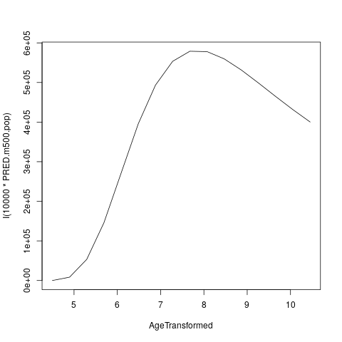

Usage
=====

.. Lifespan curve estimation (and uncertainty)

Lifespan curve estimation (and uncertainty)
------------

Although we cannot share the individual-level data, we are able to share the outcome of the analysis, namely the fitted curves.

The following GNU R objects contain the fitted model and parameter estimates for all curves within the articles:

* [BOOT_GMV.rds](Share/BOOT_GMV.rds)
* [BOOT_sGMV.rds](Share/BOOT_sGMV.rds)
* [BOOT_Ventricles.rds](Share/BOOT_Ventricles.rds)
* [BOOT_WMV.rds](Share/BOOT_WMV.rds)
* [FIT_GMV.rds](Share/FIT_GMV.rds)
* [FIT_sGMV.rds](Share/FIT_sGMV.rds)
* [FIT_Ventricles.rds](Share/FIT_Ventricles.rds)
* [FIT_WMV.rds](Share/FIT_WMV.rds)

The FIT files contain the point estimates, whereas the BOOT files contain the bootstrap replicates used to determine the uncertainty intervals.

An example of how to use these files with the code is shown below.

.. _Extracting population curves:

Extracting population curves
------------

.. code-block:: r

   source("100.common-variables.r")
   source("101.common-functions.r")

   source("300.variables.r")
   source("301.functions.r")

   FIT <- readRDS("Share/FIT_GMV.rds")

   POP.CURVE.LIST <- list(AgeTransformed=seq(log(90),log(365*95),length.out=2^4),sex=c("Female","Male"))
   POP.CURVE.RAW <- do.call( what=expand.grid, args=POP.CURVE.LIST )

   CURVE <- Apply.Param(NEWData=POP.CURVE.RAW, FITParam=FIT$param )

   plot( PRED.m500.pop ~ AgeTransformed, data=CURVE[CURVE$sex=="Female",],type="l")

   plot( I(10000*PRED.m500.pop) ~ AgeTransformed, data=CURVE[CURVE$sex=="Female",],type="l")
   
   

   
